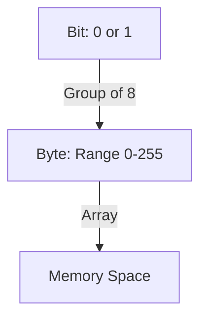

# Assembly Systems: A Visual Textbook

## Chapter 1: The Memory Model (Axioms of Storage)

### 1.1 Bits and Bytes
At the lowest level, the machine understands only presence or absence of voltage. We abstract this as **Bits** (0 or 1). Grouping bits gives us **Bytes**.



### 1.2 Hexadecimal Representation
Binary is verbose. We use Hexadecimal (Base-16) as a compact representation.
**Axiom**: 1 Hex Digit = 4 Bits. 2 Hex Digits = 1 Byte.

| Binary | Hex | Decimal |
|--------|-----|---------|
| 0000   | 0   | 0       |
| 1010   | A   | 10      |
| 1111   | F   | 15      |

### 1.3 Little-Endian Memory
x86-64 is **Little-Endian**. The *least significant byte* is stored at the *lowest address*.

**Visualization of storing `0x12345678` at `0x1000`:**

```
      Value: 0x12345678
               ↑   ↑
              MSB LSB

Memory Layout:
Address   | Content | Calculation
----------|---------|-----------------------
0x1000    |   0x78  | (0x12345678 & 0xFF)
0x1001    |   0x56  | (0x12345678 >> 8) & 0xFF
0x1002    |   0x34  | (0x12345678 >> 16) & 0xFF
0x1003    |   0x12  | (0x12345678 >> 24) & 0xFF
```

### 1.4 The Linear Memory Array
Memory is one giant array of bytes. Use indices (Addresses) to access them.

```
       0x0000...00           0xFF ... FF
[ Byte0 | Byte1 | ... | ByteN ]
    ↑                    ↑
  Text (Code)          Stack (Top)
```

---

## Chapter 2: The Register File

### 2.1 General Purpose Registers
Registers are the CPU's "hands". They hold data currently being worked on. There are 16 GPRs on x86-64, each 64 bits wide.

**Visualizing `RAX` and its subsets:**
A write to `EAX` (lower 32 bits) automatically **zeros** the upper 32 bits of `RAX`. Writes to `AX`/`AL` do not.

```
                                  RAX (64 bits)
|-----------------------------------------------------------------|
|                   (Upper 32 bits)                               |
|--------------------------------|--------------------------------|
                                 |          EAX (32 bits)         |
                                 |--------------------------------|
                                 |      (16)      |  AX (16 bits) |
                                 |----------------|-------|-------|
                                 |                |   AH  |   AL  |
                                 |----------------|-------|-------|
Bit: 63                          32               16      8       0
```

### 2.2 Trace: The Zero-Extension Rule
**Axiom**: `movl` clears bits 32-63. `movw` preserves them.

**Scenario**: `RAX = 0xFFFFFFFFFFFFFFFF`
1. **Instruction**: `movl $1, %eax`
   *   `EAX` becomes `0x00000001`
   *   Rest of `RAX` is zeroed.
   *   **Result**: `RAX = 0x0000000000000001`

2. **Scenario**: `RAX = 0xFFFFFFFFFFFFFFFF`
3. **Instruction**: `movw $1, %ax`
   *   `AX` becomes `0x0001`
   *   Upper bits preserved.
   *   **Result**: `RAX = 0xFFFFFFFFFFFF0001`

---

## Chapter 3: Addressing Modes

### 3.1 The Formula
The CPU calculates memory addresses using a standard linear formula:
$$ \text{Address} = \text{Base} + (\text{Index} \times \text{Scale}) + \text{Displacement} $$

*   **Base**: A register (start of array/struct)
*   **Index**: A register (counter)
*   **Scale**: 1, 2, 4, or 8 (item size)
*   **Displacement**: Constant offset

### 3.2 Visualizing Indexed Access
**Instruction**: `movq (%rax, %rcx, 8), %rdx`
*   `%rax` = `0x1000` (Array Base)
*   `%rcx` = `3` (Index 3)
*   `Scale` = `8` (8-byte integers)

```
   Base (0x1000)
       ↓
Memory:| [Index 0] | [Index 1] | [Index 2] | [Index 3] | ...
Addr:  | 0x1000    | 0x1008    | 0x1010    | 0x1018    |
Size:  | 8 bytes   | 8 bytes   | 8 bytes   | 8 bytes   |
```

**Derivation**:
1.  Scale * Index: `3 * 8 = 24 (0x18)`
2.  Add Base: `0x1000 + 0x18 = 0x1018`
3.  **Action**: Read 8 bytes from `0x1018`.

### 3.3 Negative Displacement (Stack Locals)
**Instruction**: `movq -8(%rbp), %rax`
Used often for accessing local variables on the stack frame relative to the base pointer.

```
       RBP (0x7000)
          ↓
... | [Local A] | [Saved RBP] | ...
    ↑
  0x6FF8
  (RBP - 8)
```

**Derivation**:
1.  Base: `0x7000`
2.  Add Disp: `0x7000 + (-8) = 0x6FF8`
3.  **Action**: Read word at `0x6FF8`.

---

## Chapter 4: The Stack

### 4.1 Push and Pop Mechanics
The stack grows **down**. Pushing decrements `RSP`. Popping increments `RSP`.

**Diagram: Pushing Value 0xAA**
Start: `RSP = 0x200`
Instruction: `pushq $0xAA`

```
Time 0:                 Time 1 (After Push):
RSP -> 0x200 [ ??? ]    0x200 [ ??? ]
       0x1F8 [ ??? ]    RSP -> 0x1F8 [ 0xAA  ]
       0x1F0 [ ??? ]           0x1F0 [ ??? ]
```
**Derivation**:
1.  `RSP` = `RSP - 8` (`0x200 - 8 = 0x1F8`)
2.  `Mem[0x1F8] = 0xAA`

**Diagram: Popping to RAX**
Start: `RSP = 0x1F8`, `Mem[0x1F8] = 0xAA`
Instruction: `popq %rax`

```
Time 1:                 Time 2 (After Pop):
RSP -> 0x1F8 [ 0xAA ]   0x200 [ ??? ]
       0x1F0 [ ??? ]    RSP -> 0x200 
                               (RAX holds 0xAA)
```
**Derivation**:
1.  Read `Mem[RSP]` (`0xAA`) into `RAX`.
2.  `RSP` = `RSP + 8` (`0x1F8 + 8 = 0x200`).

---

## Chapter 5: Virtual Dispatch Internals

### 5.1 The Object Layout
A C++ object with virtual functions begins with a **vptr** (Virtual Pointer) pointing to a **vtable**.

**Class Animal**:
```cpp
class Animal { 
  virtual void speak(); // slot 0
  int age;
}
```

**Memory Diagram (Object at 0xA000)**:
```
Address | Content       | Meaning
--------|---------------|-----------------------
0xA000  | 0x402000      | vptr (points to vtable)
0xA008  | 0x00000005    | age (5)
```

**Memory Diagram (VTable at 0x402000)**:
```
Address   | Content       | Meaning
----------|---------------|-----------------------
0x402000  | 0x00405566    | &Animal::speak
0x402008  | ...           | &Animal::~Animal
```

### 5.2 The Indirect Call Trace
Code: `obj->speak()`
ASM: `movq (%rdi), %rax` then `call *(%rax)`

**Step-by-Step Derivation**:
1.  **Input**: `RDI` = `0xA000` (this pointer).
2.  `movq (%rdi), %rax`:
    *   Read `Mem[0xA000]`.
    *   Value is `0x402000` (the vptr).
    *   `RAX` becomes `0x402000`.
3.  `call *(%rax)`:
    *   Dereference `RAX` (`Mem[0x402000]`).
    *   Value is `0x00405566` (Address of speak function).
    *   Push return address.
    *   Jump to `0x00405566`.

---

## Chapter 6: Variant Dispatch (std::visit)

### 6.1 Variant Memory Layout
`std::variant` is a tagged union. It stores an index (tag) and the data.

**Example**: `variant<int, double>` (Sizes: int=4, double=8).
Union Size = Max(4, 8) = 8.
Tag Size = 1 byte + 7 bytes padding for alignment.
Total Size = 8 + 8 = 16 bytes.

**Visual Layout**:
```
Base (0x3000)
↓
[ Tag (1B) | Pad (7B) ] [     Union Data (8B)     ]
^                       ^
Index                   Value storage
```

### 6.2 The Dispatch Table (Jump Table)
`std::visit` creates a static array of function pointers (jump targets).

**Table at 0x5000**:
*   Index 0 (int): `0x401000` (Handle Int)
*   Index 1 (dbl): `0x402000` (Handle Double)

### 6.3 Assembly Trace
Start: `RSI` = `0x3000` (Variant).

1.  **Read Tag**: `movzbl (%rsi), %eax`
    *   Read byte at `0x3000`. Let's say it's `1` (Double).
    *   `EAX = 1`.
2.  **Get Table Address**: `leaq table(%rip), %rcx`
    *   `RCX = 0x5000`.
3.  **Lookup Handler**: `movq (%rcx, %rax, 8), %rdx`
    *   Addr = `0x5000 + (1 * 8) = 0x5008`.
    *   Read `Mem[0x5008]`. Value is `0x402000`.
    *   `RDX = 0x402000`.
4.  **Prepare Data Ptr**: `addq $8, %rsi`
    *   `RSI` moves from `0x3000` to `0x3008` (Directly to Union Data).
5.  **Dispatch**: `jmp *%rdx`
    *   Jump to `0x402000`. Handler takes `RSI` (pointer to double) as argument.

---

## Chapter 7: Exercises

### Exercise 7.1: Register Math
**Given**: `RBX = 5`.
**Instruction**: `leaq 10(%rbx, %rbx, 4), %rax`.
**Task**: Calculate `RAX`.

**Work**:
1.  Base: `5`.
2.  Index * Scale: `5 * 4 = 20`.
3.  Base + (Index*Scale): `5 + 20 = 25`.
4.  Add Displacement: `25 + 10 = 35`.
**Answer**: `RAX = 35`.

### Exercise 7.2: Stack Trace
**Given**: `RSP = 0x100`.
**Code**:
```asm
pushq $0xA
pushq $0xB
popq %rax
```
**Task**: Final `RSP`?

**Work**:
1.  Push A: `RSP` -> `0xF8`.
2.  Push B: `RSP` -> `0xF0`.
3.  Pop (to RAX): `RSP` increments by 8 -> `0xF8`.
**Answer**: `RSP = 0xF8` (0xF8 = 248 decimal).

